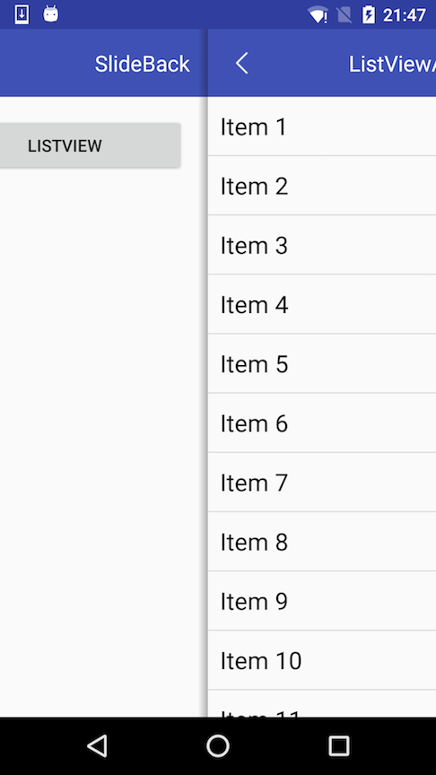
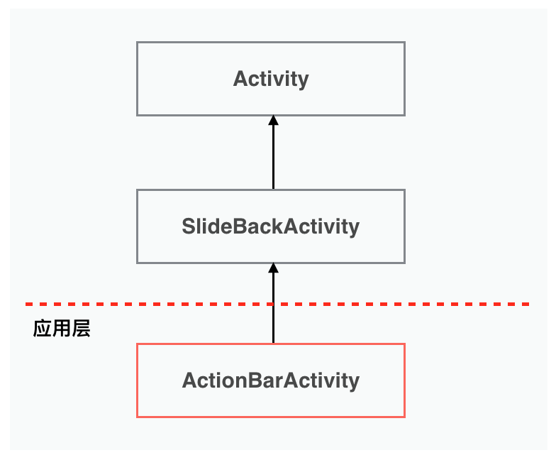
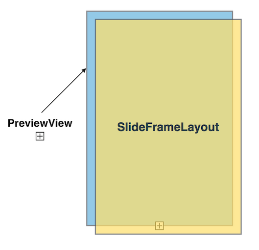

# SlideBack 

[SlideBack](https://github.com/leehong2005/SlideBack) 项目实现了类似 `iOS` 左侧滑动返回交互的功能，`Android` 平台做得最早的应该是微信，即使到了现在，有滑动返回功能的App也不是很多，就算有，做得极致的也比较少。

滑动返回功能目前我已经使用在自己的项目中了，也发现了不少问题，现在坑基本都填平了，一直就想放到 GitHub 上面来，迟迟等到今天是因为我认为始终还没达到一个完美的状态。该功能的实现最开始其实也从系统提供的组件中找到了一些灵感，典型的就是 `SlidePannel`，左侧菜单， Google 原生的 Android 应用基本都有这样的交互设计。站在前人的肩膀上，经过一番设计加工，也就有了现在的实现。

废话结束，干货开始！！

---

设计这样的框架，我觉得最重要的几个点：

* 高质量，坑少：应该是充分测试或线上应用验证过，而且需要考虑到方方面面
* 轻量、低入侵：如果集成该框架，必须对现在项目的代码改动很少，想去掉的话，以非常低的代价就可以集成或去掉，简单来说就是插拔方便
* 高性能：内存占用、不卡顿

**可以参考如下几个项目，其中 `oubowu/SlideBack` 实现的效果不错。**

* [oubowu/SlideBack](https://github.com/oubowu/SlideBack)
* [r0adkll/Slidr](https://github.com/r0adkll/Slidr)
* [XBeats/and_swipeback](https://github.com/XBeats/and_swipeback)

## 功能

* 设置滑动返回功能是否可用
* 设置前一个界面是否跟随滑动而滑动
* 设置阴影的图片
* 设置左侧边缘响应的大小（其实一般都不会用到）

## 运行截图

以下是效果图，就没生成 gif 动图了，关键是不知道怎么搞～～



*图一：运行效果截图*


## 用法

一般就两种实现方式，各有优缺点吧：

* 继承：应用方的 Activity 继承自框架的 Activity （例如：`SlideBackActivity`）
* 非继承：应用方在 Activity#setContentView(view) 之后调用框架的类来 `attach` 。

这里我选择的是 **第一种方案！**

框架的实现思路是通过继承的方式来实现的，虽然可能会更改使用方式的继承关系，但考虑到一般情况下，应用层都会有自己的统一的 Activity 基类，例如 `BaseActivity`、`ActionBarActivity` 之类的，其实修改一下这个基类的父类，就可以了。

这个框架，对外暴露提供的API就一个类：**`SlideBackActivity `**。

以下是使用方法，看好了

例如我的应用中已经有自己的通用的 Activity 基类，名字就叫：`ActionBarActivity`，在这里的用法如下：

```java
public class ActionBarActivity extends SlideBackActivity {
	...
}

```

**重点是：这里只需要把 `ActionBarActivity` 的基类改成 `SlideBackActivity` 即可。**

来看一下 sample 中的 `MainActivity` 的用法：

```java
public class MainActivity extends ActionBarActivity {

    @Override
    protected void onCreate(Bundle savedInstanceState) {
        // 首页禁用滑动返回
        setSlideable(false);

        super.onCreate(savedInstanceState);
        setContentView(R.layout.activity_main);
    }
}
```

这里调用了 `setSlideable(false);` 方法来禁用滑动返回，因为是首页嘛，不能滑动返回。

### 几个API说明

* **void setSlideable(boolean)** —— 设置滑动返回是否可用，`false`不可用，默认为`true`
* **void setPreviousActivitySlideFollow(boolean)** —— 设置前一个activity的页面是否跟随滑动面一起滑动，`false`不滑动，默认为`true`
* **void onSlideBack()** —— 滑动退出时调用的回调方法，派生类可以重写这个方法，例如可以做一些统计工作，统计关闭activity的方式，多少是滑动返回关闭的
* **void setShadowResource(int)** —— 设置阴影的资源id，一般都是写一个shape drawable

>真正大家需要关心的也前这么几个，严格来说，一般都只关心前两个就足够了～～

## 设计思考

#### 层次结构

使用了继承的设计，相当于在以前的继承关系中插入了一层，大概的类图如下所示：



*图二：设计的框架结果，应用层的 Activity 继承自框架中的 `SlideBackActivity`*


由于是使用继承的设计，子类设置的 content view，在 `SlideBackActivity` 中会把content view 添加到自己的一个叫 `SlideFrameLayout` 的容器中，它会处理各种事件。在这个容器中，还有一个用来显示前一个Activity内容的自定义视图，叫 `PreviewView`，它们的z-order是：

PreviewView: 0  
SlideFrameLayout：1

也就是说，PreviewView 在最下面，SlideFrameLayout 在最上在，对用户可见，当用户开始滑动时，把上面的 SlideFrameLayout 进行偏移，那么自然就看到下在的 PreviewView 了。 如下图所示：



*图三：`SlideFrameLayout` 与 `PreviewView` 的Z轴关系*

#### 显示前一个页面

为了显示前一个 activity 的内容，这里可能有几种方法：

**1、创建bitmap：**常见的做法是把前一个 activity 的内容绘制到一个bitmap上面，然后对 bitmap 再进行绘制。这种方法有几个缺点：

* 创建一个屏幕大小的 bitmap 特别耗内存、在创建 bitmap 的一瞬间，可能会卡顿
* 何时将 activity 的内容绘制到bitmap上面？如果启动新页面时就绘制，则可能会把前一个界面的一些按下效果也绘制上了，这个时机不好把握
* 不符合高效的原则

**2、window设置为透明：**在 manifest 中把activity的背景设置为透明，这种方案问题更大了，试想一下，如果想在 JAVA 层通过开关来控制滑动返回是否开启，你想想会是什么效果？另外一个，把窗体设置为透明，可能会带来很多坑，机型适配，沉浸式都可能会有问题。这个不符合轻量，低入侵原则。

**3、实时绘制：**把前一个 activity 的 content view （android.R.id.content）实时绘制到当前界面中。这种方法是最优的，不用创建bitamp，不用设置窗体背景。

**我这个项目中就是使用的第三种方案**，自定义的View如下，很简单：

```java
 private static class PreviewView extends View {
        private View mHostView;

        public PreviewView(Context context) {
            super(context);
        }

        public void setHostView(View view) {
            mHostView = view;
        }

        @Override
        public void draw(Canvas canvas) {
            super.draw(canvas);
            if (mHostView != null) {
                mHostView.draw(canvas);
            }
        }

        @Override
        protected void onDetachedFromWindow() {
            super.onDetachedFromWindow();
            mHostView = null;
        }
    }
```

## 优点

* 不用设置窗体的背景为透明
* 不需要对前一个 activity 进行截图，内存占用少
* 轻量、使用简单

## 缺点

* 转屏可能会存在问题，不过中国特色移动互联网里面，一般能转屏的还真不多见，所以这个问题就不是特别突显
* 修改了继承关系，如果应用层的 BaseActivity 是继承自 `FragmentActivity`，`AppCompatActivity` 的话，可能会有些问题，那么也必须把 `SlideBackActivity` 的基类也改成这些类

## 小结

**尽管我努力去做到高质量，但仍然可能存在问题，如果你在使用过程中，发现了任何问题，或者用得不爽的，可以反馈给我，欢迎同仁一起探讨交流！**

请关注：

* [Android滑动返回交互（SlideBack for Android）](http://www.jianshu.com/p/cd920718c9fa)
* [我的GitHub](https://github.com/leehong2005)
* [我的GitHub博客](http://leehong2005.com)

（完）

# License

```
Copyright 2016 LiHong Inc. 

Licensed under the Apache License, Version 2.0 (the "License");
you may not use this file except in compliance with the License.
You may obtain a copy of the License at

    http://www.apache.org/licenses/LICENSE-2.0

Unless required by applicable law or agreed to in writing, software
distributed under the License is distributed on an "AS IS" BASIS,
WITHOUT WARRANTIES OR CONDITIONS OF ANY KIND, either express or implied.
See the License for the specific language governing permissions and
limitations under the License.
```